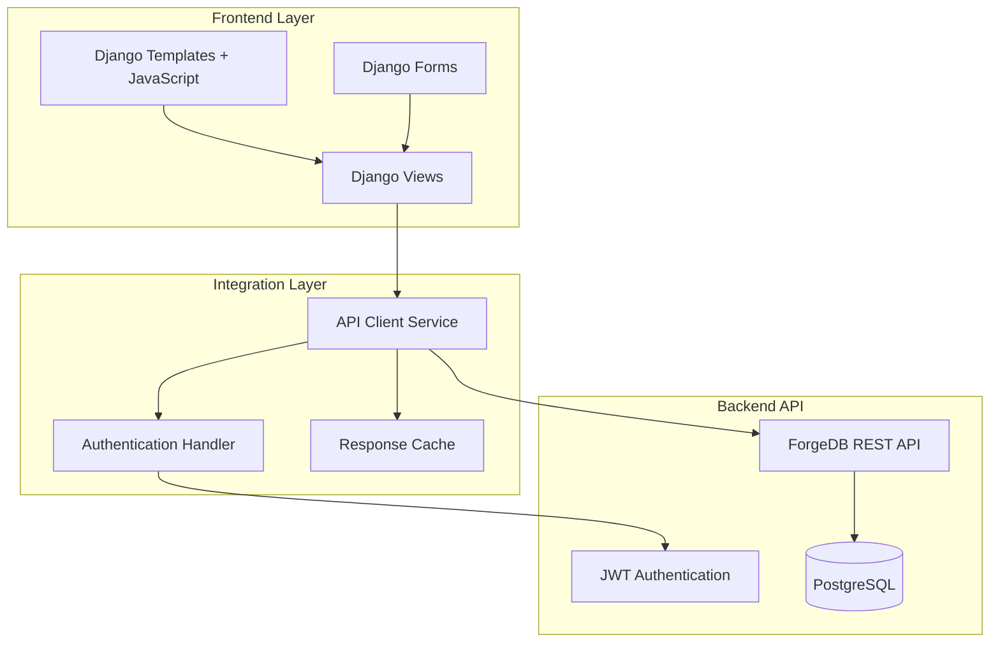

# Design Document - ForgeDB Frontend Web Application

## Overview

The ForgeDB Frontend Web Application is a comprehensive Django-based web interface that provides intuitive access to all ForgeDB automotive workshop management functionality. The frontend integrates seamlessly with the existing ForgeDB API REST backend through HTTP requests, delivering a complete user-friendly system for managing clients, work orders, inventory, and analytics through modern web forms and dashboards.

The system follows a traditional Django MVC architecture with server-side rendering, enhanced with modern JavaScript for interactive components. The design prioritizes usability, responsiveness, and maintainability while ensuring seamless integration with the existing API backend.

## Architecture

### High-Level Architecture



### Component Architecture

The frontend follows Django's MVT (Model-View-Template) pattern with additional service layers:

1. **Presentation Layer**: Django templates with Bootstrap CSS and vanilla JavaScript
2. **View Layer**: Django class-based views handling HTTP requests and responses
3. **Service Layer**: API client services for backend communication
4. **Integration Layer**: Authentication, caching, and error handling services

## Components and Interfaces

### Core Components

#### 1. Dashboard Module
- **Purpose**: Main landing page with KPIs and system overview
- **Components**: 
  - KPI widgets (active work orders, inventory alerts, technician productivity)
  - Interactive charts using Chart.js
  - Alert notification system
  - Quick navigation menu

#### 2. Client Management Module
- **Purpose**: Complete CRUD operations for client management
- **Components**:
  - Client list view with pagination, search, and filtering
  - Client creation and editing forms
  - Client detail view with service history
  - Credit status management interface

#### 3. Work Order Management Module
- **Purpose**: Comprehensive work order lifecycle management
- **Components**:
  - Work order list with status filtering
  - Work order creation wizard
  - Status progression interface
  - Service assignment and tracking

#### 4. Inventory Management Module
- **Purpose**: Complete inventory control and tracking
- **Components**:
  - Product catalog management
  - Stock level monitoring
  - Transaction history
  - Warehouse management interface

#### 5. Equipment Management Module
- **Purpose**: Equipment registration and maintenance tracking
- **Components**:
  - Equipment registry
  - Maintenance scheduling
  - Service history tracking
  - Equipment status monitoring

### API Integration Services

#### API Client Service
```python
class ForgeAPIClient:
    def __init__(self):
        self.base_url = settings.FORGE_API_BASE_URL
        self.session = requests.Session()
    
    def authenticate(self, username, password):
        # JWT authentication with backend
        pass
    
    def get_clients(self, page=1, search=None, filters=None):
        # Paginated client retrieval
        pass
    
    def create_client(self, client_data):
        # Client creation with validation
        pass
```

#### Authentication Service
```python
class AuthenticationService:
    def login(self, request, username, password):
        # Handle JWT token acquisition and storage
        pass
    
    def logout(self, request):
        # Clear authentication tokens
        pass
    
    def is_authenticated(self, request):
        # Verify token validity
        pass
```

## Data Models

### Frontend Data Models

The frontend uses lightweight data models that mirror the API responses:

#### Client Model (Frontend)
```python
class ClientData:
    def __init__(self, api_response):
        self.id = api_response.get('id')
        self.name = api_response.get('name')
        self.email = api_response.get('email')
        self.phone = api_response.get('phone')
        self.address = api_response.get('address')
        self.credit_limit = api_response.get('credit_limit')
        self.current_balance = api_response.get('current_balance')
```

#### Work Order Model (Frontend)
```python
class WorkOrderData:
    def __init__(self, api_response):
        self.id = api_response.get('id')
        self.client_id = api_response.get('client_id')
        self.equipment_id = api_response.get('equipment_id')
        self.status = api_response.get('status')
        self.created_date = api_response.get('created_date')
        self.estimated_completion = api_response.get('estimated_completion')
```

### Form Models

Django forms for data validation and rendering:

#### Client Form
```python
class ClientForm(forms.Form):
    name = forms.CharField(max_length=100, required=True)
    email = forms.EmailField(required=True)
    phone = forms.CharField(max_length=20, required=True)
    address = forms.CharField(widget=forms.Textarea, required=False)
    credit_limit = forms.DecimalField(max_digits=10, decimal_places=2)
```

## Correctness Properties

*A property is a characteristic or behavior that should hold true across all valid executions of a system-essentially, a formal statement about what the system should do. Properties serve as the bridge between human-readable specifications and machine-verifiable correctness guarantees.*

### Property Reflection

After analyzing the acceptance criteria, I identified several properties that can be consolidated:
- Properties 1.2, 1.4, and 1.5 all relate to dashboard display consistency and can be combined
- Properties 2.2, 2.3, and 2.5 all relate to form behavior and validation consistency
- Property 2.4 stands alone as it specifically tests detail view completeness

### Core Properties

**Property 1: Dashboard content completeness**
*For any* dashboard load with backend data, the rendered dashboard should contain all required metrics (active work orders, inventory alerts, technician productivity) and display alerts with appropriate severity indicators and interactive charts
**Validates: Requirements 1.2, 1.4, 1.5**

**Property 2: Navigation consistency**
*For any* navigation element click, the system should successfully navigate to the corresponding module without errors
**Validates: Requirements 1.3**

**Property 3: Form validation consistency**
*For any* form submission with invalid data, the system should display specific error messages, prevent submission, and maintain form state
**Validates: Requirements 2.2, 2.5**

**Property 4: Form pre-population accuracy**
*For any* edit operation, the form should be pre-populated with the exact existing data from the backend
**Validates: Requirements 2.3**

**Property 5: Detail view completeness**
*For any* client detail view, the displayed information should include all client data, service history, and credit status information
**Validates: Requirements 2.4**

### API Integration and Error Handling Properties

**Property 6: API integration consistency**
*For any* API endpoint call, the frontend should handle both success and error responses appropriately and provide meaningful user feedback
**Validates: Requirements 3.1, 3.4**

**Property 7: Authentication error handling reliability**
*For any* API authentication failure, the system should provide clear error messages and redirect to login when tokens are invalid or expired
**Validates: Requirements 3.2**

**Property 8: Network error fallback consistency**
*For any* network error or API unavailability, the system should display meaningful error messages and provide retry mechanisms without breaking core functionality
**Validates: Requirements 3.3**

**Property 9: API validation error display accuracy**
*For any* API response containing validation errors, the system should display field-specific error messages that accurately reflect the validation failures
**Validates: Requirements 3.5**

### Static Asset and Resource Properties

**Property 10: Static asset loading completeness**
*For any* application load, all required static files including icons, stylesheets, and JavaScript files should be served correctly without 404 errors
**Validates: Requirements 4.1**

**Property 11: Service worker registration reliability**
*For any* progressive web app feature activation, service workers should register correctly and handle offline scenarios appropriately
**Validates: Requirements 4.2**

**Property 12: Asset fallback behavior consistency**
*For any* missing static asset, the system should provide fallback behavior that maintains core functionality without breaking the user interface
**Validates: Requirements 4.3**

### Catalog Management Properties

**Property 13: Catalog interface completeness**
*For any* catalog management access, the interface should provide complete functionality for equipment types, suppliers, and automotive reference codes with proper navigation
**Validates: Requirements 5.1**

**Property 14: Taxonomy hierarchy display accuracy**
*For any* taxonomy entry creation or editing, the interface should correctly display hierarchical relationships and validate parent-child dependencies
**Validates: Requirements 5.2**

**Property 15: Reference code multilingual display consistency**
*For any* reference code management operation, the interface should provide consistent multilingual support with proper code lookup and selection capabilities
**Validates: Requirements 5.3**

**Property 16: Catalog relationship validation reliability**
*For any* catalog data update, the interface should validate relationships and display appropriate warnings to prevent data inconsistencies
**Validates: Requirements 5.4, 5.5**

### Advanced Inventory Management Properties

**Property 17: Warehouse interface completeness**
*For any* inventory management operation, the interface should provide complete functionality for multiple warehouses with accurate bin-level location tracking
**Validates: Requirements 6.1**

**Property 18: Stock transaction real-time accuracy**
*For any* stock transaction processing, the interface should display accurate real-time availability with proper reservation status indicators
**Validates: Requirements 6.2**

**Property 19: Price list interface functionality**
*For any* pricing management operation, the interface should support multiple price lists with accurate date-effective pricing displays and calculations
**Validates: Requirements 6.3**

**Property 20: Purchase order workflow completeness**
*For any* purchase order creation, the interface should provide complete procurement workflow functionality from initial creation through receipt processing
**Validates: Requirements 6.4**

**Property 21: Inventory approval workflow consistency**
*For any* inventory operation requiring approval, the interface should implement proper workflow controls with appropriate notifications and status tracking
**Validates: Requirements 6.5**

### Service Management Properties

**Property 22: Work order lifecycle interface completeness**
*For any* work order management operation, the interface should provide comprehensive service lifecycle functionality with accurate status tracking and updates
**Validates: Requirements 7.1**

**Property 23: Service assignment display accuracy**
*For any* service assignment operation, the interface should display accurate flat rate standards with equipment-specific time estimates and technician availability
**Validates: Requirements 7.2**

**Property 24: Service progress tracking reliability**
*For any* service progress monitoring, the interface should provide accurate real-time updates on task completion, parts usage, and workflow status
**Validates: Requirements 7.3**

**Property 25: Parts management interface consistency**
*For any* service item management, the interface should handle parts reservation, usage tracking, and return processing with accurate status displays
**Validates: Requirements 7.4**

**Property 26: Service checklist verification completeness**
*For any* service requiring quality verification, the interface should provide structured checklists with mandatory verification steps and completion tracking
**Validates: Requirements 7.5**

### OEM Catalog Integration Properties

**Property 27: OEM search interface functionality**
*For any* OEM part search operation, the interface should provide advanced search capabilities with VIN pattern filtering and specification-based queries
**Validates: Requirements 8.1**

**Property 28: OEM part detail display completeness**
*For any* OEM part detail view, the interface should display complete part information with compatibility data, specifications, and availability status
**Validates: Requirements 8.2**

**Property 29: Part equivalence display accuracy**
*For any* part equivalence request, the interface should show accurate aftermarket alternatives with confidence ratings, availability, and pricing information
**Validates: Requirements 8.3**

**Property 30: OEM data management interface reliability**
*For any* OEM data management operation, the interface should provide proper version control functionality with validity date management and change tracking
**Validates: Requirements 8.4**

**Property 31: Equivalence ranking display consistency**
*For any* part with multiple equivalences, the interface should display alternatives ranked by compatibility, quality, cost, and availability factors
**Validates: Requirements 8.5**

### Alert and Audit System Properties

**Property 32: Alert display classification accuracy**
*For any* system alert, the interface should display alerts with appropriate severity indicators, proper assignment capabilities, and clear action requirements
**Validates: Requirements 9.1**

**Property 33: Business rule violation display completeness**
*For any* business rule violation, the interface should show clear violation details with specific recommended corrective actions and resolution steps
**Validates: Requirements 9.2**

**Property 34: Audit information display comprehensiveness**
*For any* audit information request, the interface should provide comprehensive change tracking with user identification, timestamps, and modification details
**Validates: Requirements 9.3**

**Property 35: Alert action interface functionality**
*For any* alert requiring action, the interface should provide complete acknowledgment, resolution, and escalation capabilities with proper workflow tracking
**Validates: Requirements 9.4**

**Property 36: Compliance reporting interface completeness**
*For any* compliance reporting need, the interface should generate comprehensive audit reports with proper filtering, sorting, and export capabilities
**Validates: Requirements 9.5**

### Performance Analytics Properties

**Property 37: KPI dashboard display accuracy**
*For any* performance data access, the interface should display comprehensive KPI dashboards with accurate real-time metrics and proper data visualization
**Validates: Requirements 10.1**

**Property 38: Work order analytics completeness**
*For any* work order analysis, the interface should show complete efficiency scores, quality ratings, and productivity measurements with trend analysis
**Validates: Requirements 10.2**

**Property 39: Technician performance display reliability**
*For any* technician performance review, the interface should provide accurate individual and comparative performance analytics with proper benchmarking
**Validates: Requirements 10.3**

**Property 40: Report generation flexibility**
*For any* report generation request, the interface should support flexible filtering by time periods, technicians, service types, and other relevant criteria
**Validates: Requirements 10.4**

**Property 41: Benchmarking analysis display accuracy**
*For any* benchmarking requirement, the interface should display accurate comparative analysis against historical data and industry standards with clear visualizations
**Validates: Requirements 10.5**

## Error Handling

### API Error Handling
- **Connection Errors**: Display user-friendly messages for network issues
- **Authentication Errors**: Redirect to login with appropriate messaging
- **Validation Errors**: Display field-specific error messages
- **Server Errors**: Show generic error page with retry options

### Form Error Handling
- **Client-side Validation**: JavaScript validation for immediate feedback
- **Server-side Validation**: Django form validation with error display
- **API Validation**: Handle and display API validation responses

### User Experience Error Handling
- **Loading States**: Show spinners during API calls
- **Empty States**: Display helpful messages when no data exists
- **Error Recovery**: Provide clear paths to resolve errors

## Testing Strategy

### Dual Testing Approach

The frontend will implement both unit testing and property-based testing to ensure comprehensive coverage:

**Unit Testing**:
- Test specific user interactions and edge cases
- Verify form validation logic
- Test API integration points
- Validate template rendering with specific data sets

**Property-Based Testing**:
- Use Hypothesis for Python to generate random test data
- Configure each property-based test to run a minimum of 100 iterations
- Test universal properties across all possible inputs
- Verify system behavior with various data combinations

### Testing Framework Configuration

**Primary Testing Stack**:
- **Django TestCase**: For integration testing with database
- **Hypothesis**: For property-based testing (minimum 100 iterations per test)
- **Selenium**: For end-to-end browser testing
- **Mock**: For API response simulation

**Property-Based Test Requirements**:
- Each correctness property must be implemented by a single property-based test
- Each test must be tagged with: `**Feature: forge-frontend-web, Property {number}: {property_text}**`
- Tests must reference the design document property they implement
- Minimum 100 iterations per property test to ensure thorough coverage

### Test Coverage Requirements

**Unit Tests Coverage**:
- All Django views and forms
- API client service methods
- Authentication and authorization logic
- Template rendering with edge cases

**Property-Based Tests Coverage**:
- Dashboard content completeness across all data variations
- Navigation consistency across all modules
- Form validation across all input combinations
- Data display accuracy across all entity types

The combination of unit tests and property-based tests ensures both concrete bug detection and general correctness verification across the entire input space.