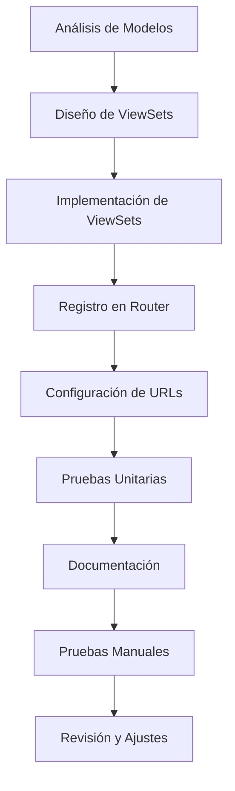

# Plan Detallado para la Implementación de ViewSets CRUD (Tarea 5)

## Descripción General

Este plan detalla la implementación de ViewSets CRUD para todas las entidades del sistema ForgeDB. La implementación seguirá las mejores prácticas de Django REST Framework y se integrará con los modelos y serializadores ya existentes.

## Arquitectura de ViewSets

Se implementarán ViewSets separados para cada modelo del sistema, siguiendo este enfoque:

1. **Separación por Esquemas**: Los ViewSets se organizarán según los esquemas de la base de datos (cat, inv, svc, app, doc)
2. **Consistencia**: Todos los ViewSets seguirán un patrón consistente de implementación
3. **Permisos**: Se integrarán con el sistema de autenticación y autorización existente

## ViewSets a Implementar

### Esquema CAT (Catálogos)
- ClientViewSet
- EquipmentViewSet
- TechnicianViewSet

### Esquema INV (Inventario)
- ProductMasterViewSet
- StockViewSet
- TransactionViewSet
- WarehouseViewSet

### Esquema SVC (Servicios)
- WorkOrderViewSet
- InvoiceViewSet

### Esquema APP (Aplicación)
- AlertViewSet
- BusinessRuleViewSet
- AuditLogViewSet

### Esquema DOC (Documentos)
- DocumentViewSet

## Funcionalidades CRUD por ViewSet

Cada ViewSet implementará las operaciones estándar CRUD:
- Listado (GET /api/v1/{entidad}/)
- Detalle (GET /api/v1/{entidad}/{id}/)
- Creación (POST /api/v1/{entidad}/)
- Actualización parcial (PATCH /api/v1/{entidad}/{id}/)
- Actualización completa (PUT /api/v1/{entidad}/{id}/)
- Eliminación (DELETE /api/v1/{entidad}/{id}/)

## Características Adicionales

### Paginación
- Implementación de paginación para todos los listados
- Tamaño de página configurable

### Filtrado
- Filtrado básico por campos clave
- Filtrado avanzado usando django-filter

### Ordenamiento
- Ordenamiento por campos relevantes

### Búsqueda
- Búsqueda de texto en campos apropiados

## Integración con Sistema de Permisos

Cada ViewSet utilizará las clases de permisos personalizadas ya implementadas:
- IsWorkshopAdmin
- CanManageInventory
- CanManageClients
- CanViewReports
- IsTechnicianOrReadOnly

## Pruebas

Se crearán pruebas unitarias para cada ViewSet que verifiquen:
- Operaciones CRUD básicas
- Permisos de acceso
- Validaciones de datos
- Respuestas de error apropiadas

## Documentación

Se generará documentación automática usando drf-yasg que incluirá:
- Descripción de cada endpoint
- Parámetros esperados
- Ejemplos de respuestas
- Códigos de error posibles

## Flujo de Trabajo de Implementación

## Consideraciones Técnicas

1. **Rendimiento**: Implementación de select_related y prefetch_related donde sea apropiado
2. **Seguridad**: Validación de datos en el nivel del serializer y del modelo
3. **Mantenibilidad**: Código limpio y bien documentado
4. **Escalabilidad**: Diseño que permita fácil expansión futura

## Entregables

1. Archivos de ViewSets implementados en `forge_api/core/views/`
2. Actualización de `forge_api/core/urls.py` con nuevos ViewSets
3. Pruebas unitarias en `forge_api/core/tests/`
4. Documentación actualizada